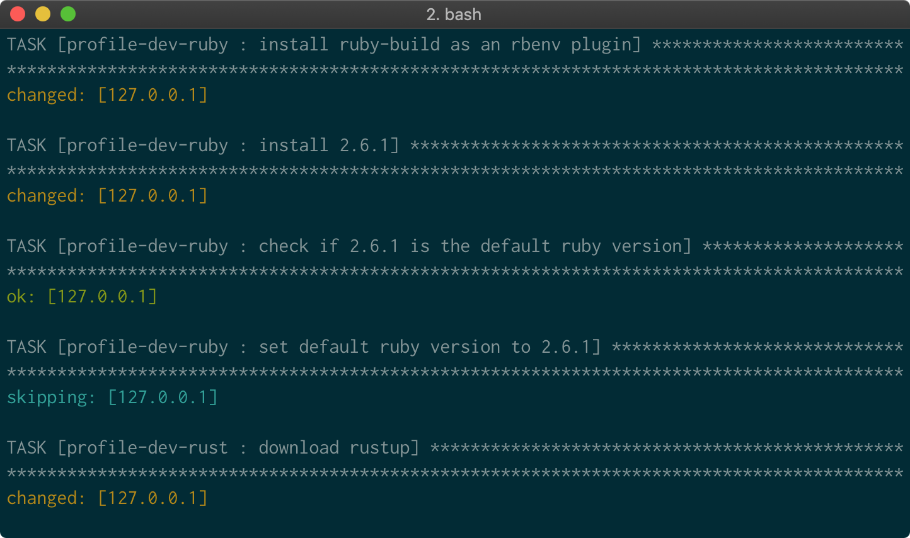

# Mac Dev

This [Ansible](https://www.ansible.com/) playbook installs and configures most of the stuff I use on my Mac for software development.



## Usage

Install command line tools for Xcode:

```sh
$ xcode-select --install
```

If on Mojave, also run:

```sh
$ sudo installer -pkg /Library/Developer/CommandLineTools/Packages/macOS_SDK_headers_for_macOS_10.14.pkg -target /
```

Finally run:

```sh
$ ./install.sh
```

To change the default shell back to `bash` on Catalina, run:

```
sudo -i echo /usr/local/bin/bash >> /etc/shells
chsh -s /usr/local/bin/bash
```

## Meta

- Code: `git clone git://github.com/unindented/mac-dev.git`
- Home: <https://github.com/unindented/mac-dev/>

## Contributors

Daniel Perez Alvarez ([unindented@gmail.com](mailto:unindented@gmail.com))

## License

Copyright (c) 2021 Daniel Perez Alvarez ([unindented.org](https://unindented.org/)). This is free software, and may be redistributed under the terms specified in the LICENSE file.
